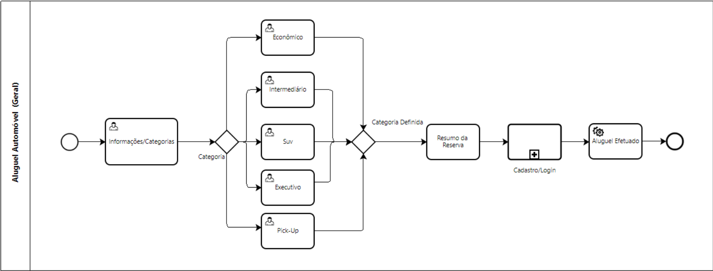
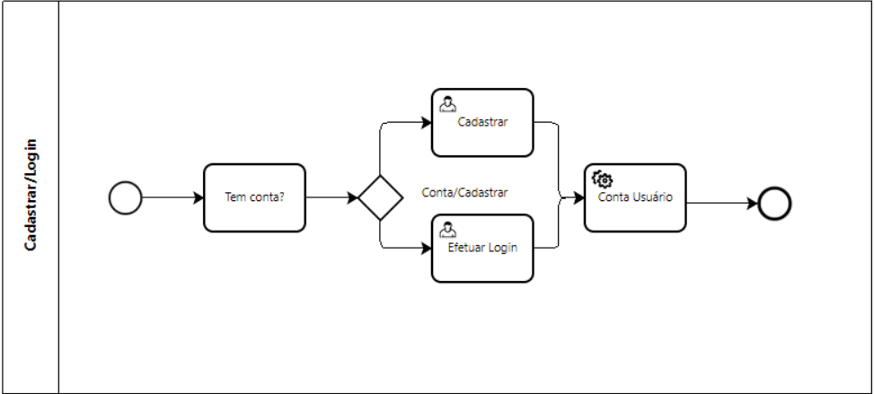
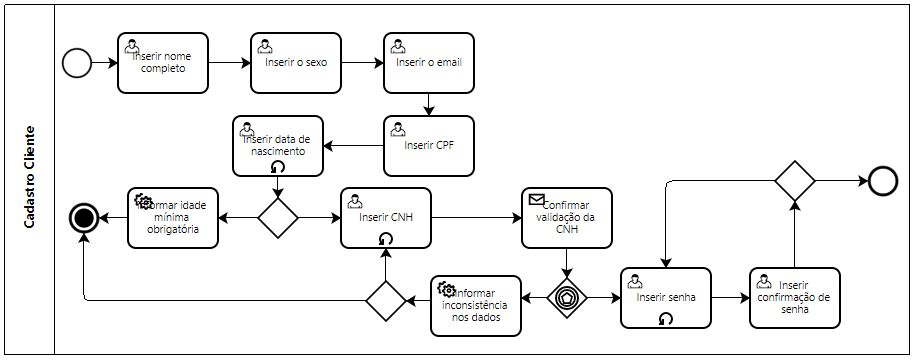
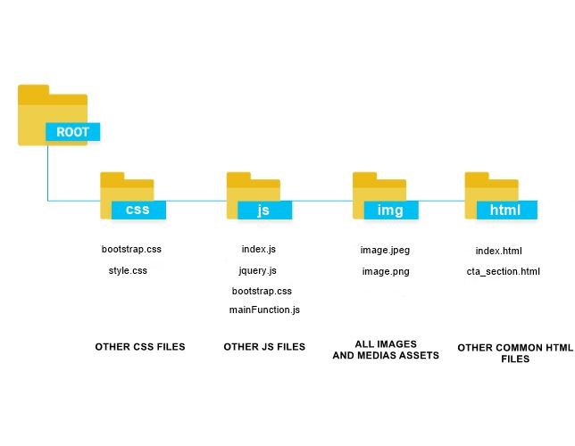
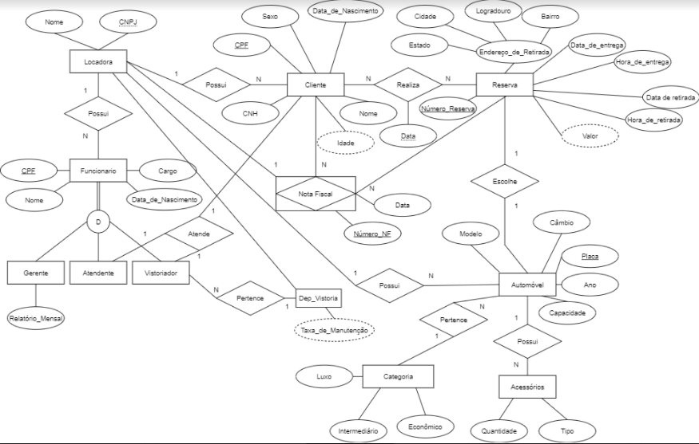

# LocaLex Rent Car Point

Alexandre Costa e Souza

Arthur Vítor Sapore - arthur.sapore@sga.pucminas.br

**Yghor Ribas Gomes - yghor.gomes@sga.pucminas.br**

Paulo Victor Jesus de Sousa - paulo.sousa.1137246@sga.pucminas.br

Tarcísio Pais de Souza Junior - tarcisio.junior.1284505@sga.pucminas.br

---

_Curso de Engenharia de Software, Unidade Praça da Liberdade_

_Instituto de Informática e Ciências Exatas – Pontifícia Universidade de Minas Gerais (PUC MINAS), Belo Horizonte – MG – Brasil_

---

_**Resumo**. Escrever aqui o resumo. O resumo deve contextualizar rapidamente o trabalho, descrever seu objetivo e, ao final, 
mostrar algum resultado relevante do trabalho (até 10 linhas)._

---

## 1. Introdução
  A indústria automobilística está presente no desenvolvimento de projetos e montagem de veículos, esse setor veio modificando nossas vidas desde o início do século XIX. Ela foi fundamental até mesmo para a globalização, "encurtando" as distâncias entre uma cidade e outra, mas não apenas na globalização, ela também é um dos moldes da nossa sociedade moderna, transformando uma ferramenta de locomoção em um sinal de status e luxo.
  Apesar de muito útil esses automóveis custosos àqueles que os possuem, tanto para a aquisição quanto para a manutenção. Decorrendo desse fato muitas pessoas optam pela locação, já que os custos desse tipo de serviços são extremamente ínfimos se comparados com a compra de um veículo.

1.1 Contextualização:
De acordo com o Anuário Brasileiro do Setor de Locação de Veículos | 2020, o setor de aluguel de automóveis vem se expandindo desde o final de 2015, com um aumento de aproximadamente 7bilhões de faturamento líquido entre 2016 e 2019, uma taxa de imposto muito menor se comparado com as taxas de compra de um automóvel e uma impressionante alta de usuários desse tipo de serviço, saindo de 23,2milhões em 2016 até 49,6milhões em 2019.

http://www.virapagina.com.br/abla2020/26/#zoom=z

1.2 Problema:
Preços de compra e manutenção desse tipo de bem é muito custosa, tornando-o inviável aqueles que precisam de um uso momentâneo desses veículos.

1.3 Objetivo Geral:
Criar mais uma opção para interessados em alugar qualquer tipo de veículo.

1.3.1 Objetivos Especificos:
Alugar carros.

1.4 Justificativa:
Grande volume de clientes que procuram esse tipo de serviço desde 2015.

## 2. Participantes do processo

Diversos são os perfis dos Stakeholders chaves para uma locadora de veículos. Por exemplo: adultos de 25 anos ou mais, pais de família, recentemente desempregados que possuem CNH e que precisam de um automóvel para trabalhar como motorista de aplicativo; um casal de turistas de classe média, que precisarão de um automóvel para se locomoverem entres os pontos turísticos de uma cidade; empresas de serviços, como por exemplo, uma empresa de telefonia ou provedora de internet que precisa de uma frota de veículos para seus técnicos realizarem a manutenção ou a instalação de pontos de acesso para seus clientes.

## 3. Modelagem do processo de negócio

## 3.1. Análise da situação atual

Atualmente, as empresas de aluguéis de automóveis utilizam de sites e aplicativos mobile basicamente com as mesmas funcionalidades, começando com o cliente informando o local onde será realizada a retirada do automóvel, o dia e horário que será feita e dia e horário da entrega. 
Algumas empresas utilizam o sistema de chatbot para retirada de dúvidas (algo muito útil) e outras não, contendo fóruns específicos para o assunto. Outra diferença entre algumas empresas do setor, é que há aquelas que alugam somente dentre pacotes disponíveis, no caso, mínimo de 30 dias, se tratando de um ponto decisivo na escolha da empresa para o aluguel. 

Após informado os dados de retirada e entrega (dia e horário), o cliente escolhe dentro as categorias - Econômico, Intermediário, Suv, Executivo, Pick-Up, entre outros - o veículo de seu interesse. Vale acrescentar um ponto de melhoria dessa etapa: mostrar para o usuário apenas os veículos disponíveis para o cliente, pois hoje, é mostrado alguns veículos, mas eles estão como "indisponível para retirada", sendo desnecessária sua visualização no momento. Um diferencial que adotaremos no software da empresa será salvar os "registros de aluguéis" realizados pelo cliente, sendo composto pelo automóvel, meio de pagamento (caso cartão de crédito), informações adicionais como coberturas para terceiros, caso tenha selecionado. Isso com o intuito de caso ele alugar o mesmo veículo, algumas etapas sejam removidas e o processo seja mais simples.  

Chega então a etapa de resumo da reserva, com o veículo escolhido, além da descrição do valor total a ser pago, com a possibilidade de acrescentar adicionais como "cobertura para terceiros".
Por fim tem-se o cadastro (para os novatos) ou o login (para os que já tem conta), adicionando o meio de pagamento e fechando sua reserva de acordo com as informações detelhadas da etapa anterior.

## 3.2. Descrição Geral da proposta

O objetivo da LocaLex é ser uma locadora de automóveis, onde os processos de escolha, reserva de um veículo e o período de aluguel, será realizado totalmente via Web, visando a diminuição de custos. Um ponto de melhoria que será acrescentado nessa etapa, em relação aos processos de outras empresas do ramo, será: mostrar para o usuário apenas os veículos disponíveis para o cliente no momento da interação do cliente com o nosso sistema, pois, atualmente é mostrado alguns veículos, mas eles estão como “indisponível para retirada", sendo desnecessária sua visualização no momento.

A empresa atuará inicialmente em Belo Horizonte, atendendo tanto pessoa física quanto pessoa jurídica. Os serviços da LocaLex começam pela escolha e o período do aluguel de um veículo no site da empresa, logo depois o cliente se direcionará até uma loja física da empresa com a habilitação em mãos para poder pegar o carro. Um diferencial que adotaremos no sistema da empresa, será salvar os dados de aluguéis anteriores, realizados pelo cliente, como por exemplo: Se um cliente aluga um Fox 2018, prata, com ar-condicionado e paga no cartão com um número x e sem cobertura para terceiros, quando ele for alugar novamente, ele pode selecionar esse registro com tudo já preenchido, ele não vai precisar preencher os dados novamente, só se ele quiser adicionar ou remover produtos adicionais. Isso será feito com o intuito de, caso ele queira alugar o mesmo veículo, algumas etapas sejam removidas e o processo seja mais simples.

Após o período de aluguel do veículo, o cliente deverá se dirigir até a loja com o carro no mesmo estado que lhe foi arrendado, caso o carro não esteja no mesmo estado, será acionado o seguro e o cliente deverá pagar a franquia.

## 3.3. Processos

### 3.3.1 Processo 1 – Aluguel de Automóveis Geral

O modelo abaixo apresenta de forma geral as etapas envolvidas no processo de alguel de um veículo pela plataforma LocaLex Rent Car Point. Se trata de um processo geral, por isso pode não estar totalmente entendívei. O subprocesso presente será apresentado adiante.

### 3.3.2 Processo 2 – Subprocesso Cadastro/Login do Processo "Aluguel de Automóveis Geral"

Subprocesso responsável pelo cadastro ou login do usuário na plataforma LocaLex Rent Car Point. O usuário informa algumas informações sensíveis ao cadastrar, ou o email e senha, caso já tenha uma conta no sistema.

### 3.3.3 Processo 3 – Processo de Cadastro do Cliente

Processo que represta o login do cliente no sistema da Localex Rent Car Point. O usuário informa seus dados pessoais e a partir de algumas verificações o cadastro pode ser efetivado ou não.

.

### 3.3.4 Processo 4 – Processo de Escolha de um Carro

Processo que representa as etapas que o cliente terá de passar na escolha de um carro para seguir o fluxo de locação. O usuário deve escolher um carro dentro de cada classe desejada e selecionar o seguro obrigatório. A escolha de seguros extras e acessórios são opcionais ao usuário.

.

### 3.3.5 Processo 5 – Processo de Avaliação do Aluguel de Automóveis

Processo responsável por sugerir ao cliente uma avaliação e um comentário do serviço de Locação de Veículo da LocaLex.

## 4. Projeto da Solução

### 4.1. Detalhamento das atividades

Descrever aqui cada uma das propriedades das atividades de cada um dos processos. Devem estar relacionadas com o modelo de processo apresentado anteriormente.

#### Processo 1 – Aluguel de Automóveis Geral

**Pesquisar por veículos**

| **Campo** | **Tipo** | **Restrições** | **Valor default** |
| --- | --- | --- | --- |
| Todos | Área de texto | Veículo já cadastrado |  |
| SUV | Área de texto | Veículo já cadastrado |  |
| Pick-Up | Área de texto | Veículo já cadastrado |  |
| Executivo | Área de texto | Veículo já cadastrado |  |
| Intermediário | Área de texto | Veículo já cadastrado |  |
| Econômico | Área de texto | Veículo já cadastrado |  |

**Realizar o Login**

| **Campo** | **Tipo** | **Restrições** | **Valor default** |
| --- | --- | --- | --- |
| Email | Caixa de texto | Deve está cadastrado no banco de dados |  |
| Senha | Caixa de texto | Mínimo de 8 caracteres |  |

**Resumo da Reserva**

| **Campo** | **Tipo** | **Restrições** | **Valor default** |
| --- | --- | --- | --- |
| Resumo da Reserva | Área de texto |  |  |
| Continuar | Link |  |  |

#### Processo 2 – Subprocesso Cadastro/Login do Processo "Aluguel de Automóveis Geral"

**Verifica Conta**

| **Campo** | **Tipo** | **Restrições** | **Valor default** |
| --- | --- | --- | --- |
| Possui conta? | Link |  |  |

#### Processo 3 – Processo de Cadastro do Cliente

**Cadastrar**

| **Campo** | **Tipo** | **Restrições** | **Valor default** |
| --- | --- | --- | --- |
| Nome Completo | Caixa de Texto | Preenchimento obrigatório |  |
| Sexo | Seleção única | Uma opção selecionado |  |
| Email | Caixa de Texto | Formato de e-mail |  |
| CPF | Número | Mínimo de 11 cacteres |  |
| Data de Nascimento | Caixa de Texto | Mínimo de 21 anos |   |
| Inserir CNH | Número | Mínimo 11 caracteres |   |
| Senha | Caixa de Texto | Mínimo de 8 caracteres |   |
| Confirmar Senha | Caixa de Texto | Valor idêntico ao da senha |   |

#### Processo 4 – Processo de Escolha de um Carro

**Escolhendo um Carro**

| **Campo** | **Tipo** | **Restrições** | **Valor default** |
| --- | --- | --- | --- |
|   Selecionar Carro  |   Seleção Única |  | |
|   Selecionar Proteções  |   Seleção  | Mínimo uma proteção selecionada | Proteção básica. |
|   Selecionar Proteções Extras  |  Múltipla escolha | |  |
|   Selecionar Acessórios  |   Seleção Única | |  |
|   Informar Quantidade de Acessórios  |  Seleção Única | Quantidade mínima: 1 | 1 |

#### Processo 5 – Processo de Avaliação do Aluguel de Automóveis

**Avaliação do aluguel**

| **Campo** | **Tipo** | **Restrições** | **Valor default** |
| --- | --- | --- | --- |
| Selecionar Avaliação | Seleção única | Escolher no mínimo uma avaliação|  |

**Comentário do serviço**

| **Campo** | **Tipo** | **Restrições** | **Valor default** |
| --- | --- | --- | --- |
| Comentar | Caixa de texto |  |  |

### 4.2. Tecnologias

Tecnologias: HTML5,CSS3,JavaScript.

Frameworks: Bootstrap.

## 5. Modelagem de dados

Apresente o modelo de dados. Defina o dicionário de dados com os respectivos formatos e significados.

### 5.1. Diagrama de Entidade-Relacionamento

Apresente aqui o Diagrama de Entidade-Relacionamento (DER) que contemple todos conceitos e atributos apresentados item anterior. Deve contemplar também o controle de acesso de usuários de acordo com os papeis definidos nos modelos do processo de negócio.

## 6. Indicadores de desempenho

Apresente aqui os principais indicadores de desempenho e algumas metas para o processo. Atenção: as informações necessárias para gerar os indicadores devem estar contempladas no diagrama de classe. Colocar no mínimo 5 indicadores.

Usar o seguinte modelo:

| **Indicador** | **Objetivos** | **Descrição** | **Cálculo** | **Fonte dados** | **Perspectiva** |
| --- | --- | --- | --- | --- | --- |
| Percentual reclamações | Avaliar quantitativamente as reclamações | Percentual de reclamações em relação ao total atendimento |   | Tabela reclamações | Aprendizado e Crescimento |
| Taxa de Requisições abertas | Melhorar a prestação de serviços medindo a porcentagem de requisições | Mede % de requisições atendidas na semana | \*100 | Tabela solicitações | Processos internos |
| Taxa de entrega de material | Manter controle sobre os materiais que estão sendo entregues | Mede % de material entregue dentro do mês |   | Tabela Pedidos | Clientes |

Obs.: todas as informações para gerar os indicadores devem estar no diagrama de classe **a ser proposto**

## 7.Sistema desenvolvido

Faça aqui uma breve descrição do software e coloque as principais telas com uma explicação de como usar cada uma.

## 8. Avaliação

Faça aqui sobre a avaliação do software. Indique se ele atendeu as expectativas e ele é viável. Para não ficar subjetivo, o ideal é fazer um questionário e pedir ao usuário do processo que faça a avaliação

## 9. Conclusão

Apresente aqui a conclusão do seu trabalho. Discussão dos resultados obtidos no trabalho, onde se verifica as observações pessoais de cada aluno. Poderá também apresentar sugestões de novas linhas de estudo.

# REFERÊNCIAS

Como um projeto de software não requer revisão bibliográfica, a inclusão das referências não é obrigatória. No entanto, caso você deseje incluir referências relacionadas às tecnologias, padrões, ou metodologias que serão usadas no seu trabalho, relacione-as de acordo com a ABNT.

Verifique no link abaixo como devem ser as referências no padrão ABNT:

http://www.pucminas.br/imagedb/documento/DOC\_DSC\_NOME\_ARQUI20160217102425.pdf

**[1.1]** - _ELMASRI, Ramez; NAVATHE, Sham. **Sistemas de banco de dados**. 7. ed. São Paulo: Pearson, c2019. E-book. ISBN 9788543025001._

**[1.2]** - _COPPIN, Ben. **Inteligência artificial**. Rio de Janeiro, RJ: LTC, c2010. E-book. ISBN 978-85-216-2936-8._

**[1.3]** - _CORMEN, Thomas H. et al. **Algoritmos: teoria e prática**. Rio de Janeiro, RJ: Elsevier, Campus, c2012. xvi, 926 p. ISBN 9788535236996._

**[1.4]** - _SUTHERLAND, Jeffrey Victor. **Scrum: a arte de fazer o dobro do trabalho na metade do tempo**. 2. ed. rev. São Paulo, SP: Leya, 2016. 236, [4] p. ISBN 9788544104514._

**[1.5]** - _RUSSELL, Stuart J.; NORVIG, Peter. **Inteligência artificial**. Rio de Janeiro: Elsevier, c2013. xxi, 988 p. ISBN 9788535237016._

# APÊNDICES

**Colocar link:**

Do código;

Dos artefatos;

Da apresentação final;

Do vídeo de apresentação.

